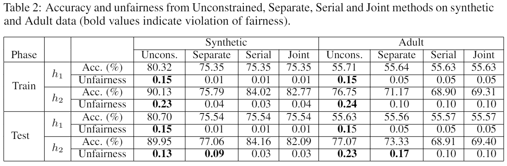

# Fair Multiple Decision Making Through Soft Interventions
This repository is the official implementation of [Fair Multiple Decision Making Through Soft Interventions](https://proceedings.neurips.cc//paper/2020/hash/d0921d442ee91b896ad95059d13df618-Abstract.html).

## Overview
+ `data` contrains the data
+ `models` contains the codes for four models.
+ `synthetic` contains the experiments on synthetic dataset.
+ `adult` contains the experiments on Adult dataset.
+ `results` contains the generated result files.

## Usage

+ To reproduce the experiments on synthetic dataset, get into the synthetic directory and run following commands:
```
python synthetic_main.py --model unconstrained_model             # run Unconstrained method
python synthetic_main.py --model separate_constrained_model      # run Separate method
python synthetic_main.py --model serial_constrained_model        # run Serial method
python synthetic_main.py --model joint_constrained_model         # run Joint method
```
+ To reproduce the experiments on Adult dataset, get into the adult directory and run following commands:
```
python adult_processing.py                                       # generate preprocessed data

python adult_main.py --model unconstrained_model                 # run Unconstrained method
python adult_main.py --model separate_constrained_model          # run Separate method
python adult_main.py --model serial_constrained_model            # run Serial method
python adult_main.py --model joint_constrained_model             # run Joint method
```

## Requirements and dependencies
This project was designed with Python 3.7. We can not guarantee and have not tested compability with Python 2.7.

Required python packages:

+ numpy
+ scipy
+ pandas
+ logging
+ argparse
+ scikit-learn
+ imblearn  
+ cvxpy
+ pytorch

## Results



## Citation
```
@article{hu2020fair,
  title={Fair Multiple Decision Making Through Soft Interventions},
  author={Hu, Yaowei and Wu, Yongkai and Zhang, Lu and Wu, Xintao},
  journal={Advances in Neural Information Processing Systems},
  volume={33},
  year={2020}
}
```
